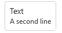

# Compound Button

## Background

The `CompoundButton` is a `Button` that is designed to show an extra line of text.
Does not render on mobile (Android/iOS).

## Requirements

If using FURN's theming, the `CompoundButton` requires use of the `ThemeProvider` from `@fluentui-react-native/theme` to work properly with themes. Please see [this page](../../../../../docs/pages/Guides/UpdateThemeProvider.md) for information on updating your `ThemeProvider` if using the version from `@uifabricshared/theming-react-native`.

## Sample Code

Basic examples:

```jsx
<CompoundButton secondaryContent="A second line">Text</CompoundButton>
<CompoundButton icon={{ svgSource: { uri: 'https://www.example.com/test.svg', viewBox: '0 0 100 100' } }} secondaryContent="A second line" />
<CompoundButton icon={{ svgSource: { uri: 'https://www.example.com/test.svg', viewBox: '0 0 100 100' } }} secondaryContent="A second line">Text</CompoundButton>
<CompoundButton appearance="primary" secondaryContent="A second line">Text</CompoundButton>
<CompoundButton disabled secondaryContent="A second line">Text</CompoundButton>
<CompoundButton size="small" secondaryContent="A second line">Text</CompoundButton>
```

More examples on the [Test pages for the Button](../../../../../apps/fluent-tester/src/TestComponents/Button). Instructions on running the tester app can be found [here](../../../../../apps/fluent-tester/README.md).

## Visual Examples

Win32:



```tsx
<CompoundButton secondaryContent="A second line">Text</CompoundButton>
```


```tsx
<CompoundButton appearance="primary" secondaryContent="A second line">
  Text
</CompoundButton>
```

## Variants

Variant options are the same as the base `Button` component. This section will note main differences in design from the the base `Button` component.

### Icon

The space for the icon is larger in a `CompoundButton`. The `CompoundButton` is designed so that it can hold an illustration in the place of an icon.

## API

### Slots

The `CompoundButton` component has three slots, or parts. The slots behave as follows:

- `root` - The outer container representing the `CompoundButton` itself that wraps everything passed via the `children` prop.
- `icon` - If specified, renders an `icon` either before or after the `children` as specified by the `iconPosition` prop.
- `contentContainer` - An inner container which wraps the text of the control.
- `content` - If specified, renders the first entry of `children` as text.
- `secondaryContent` - If specified, renders `text`, usually in a smaller font than the `content` slot to show that it is descriptive text.

The slots can be modified using the `compose` function on the `CompoundButton`. For more information on using the `compose` API, please see [this page](../../../../framework/composition/README.md).

### Props

```ts
export interface CompoundButtonProps extends ButtonProps {
  /**
   * Second line of text that describes the action this button takes.
   */
  secondaryContent?: string;
}
```

### Styling Tokens

Tokens can be used to customize the styling of the control by using the `customize` function on the `Button`. For more information on using the `customize` API, please see [this page](../../../../framework/composition/README.md). The `CompoundButton` has the following tokens:

```ts
export interface CompoundButtonTokens extends ButtonTokens {
  /**
   * Font of the second line of text on the button.
   */
  secondaryContentFont?: FontTokens;

  /**
   * Color of the second line of text on the button.
   */
  secondaryContentColor?: ColorValue;

  /**
   * States that can be applied to a button.
   * These can be used to modify styles of the button when under the specified state.
   */
  hovered?: CompoundButtonTokens;
  focused?: CompoundButtonTokens;
  pressed?: CompoundButtonTokens;
  disabled?: CompoundButtonTokens;
  primary?: CompoundButtonTokens;
  subtle?: CompoundButtonTokens;
  small?: CompoundButtonTokens;
  medium?: CompoundButtonTokens;
  large?: CompoundButtonTokens;
}
```

## Behaviors

Same as base `Button`.
