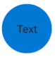

# FAB

## Background

`FAB` stands for `Floating Action Button`. The `FAB` is a `Button` that is designed for mobile scenarios to signal primary actions to the user. This button only renders on mobile platforms.

## Requirements

If using FURN's theming, the `FAB` requires use of the `ThemeProvider` from `@fluentui-react-native/theme` to work properly with themes. Please see [this page](../../../../../docs/pages/Guides/UpdateThemeProvider.md) for information on updating your `ThemeProvider` if using the version from `@uifabricshared/theming-react-native`.

## Sample Code

Basic examples:

```jsx
<FAB>Text</FAB>
<FAB icon={{ svgSource: { uri: 'https://www.example.com/test.svg', viewBox: '0 0 100 100' } }} iconOnly/>
<FAB icon={{ svgSource: { uri: 'https://www.example.com/test.svg', viewBox: '0 0 100 100' } }}>Text</FAB>
<FAB appearance="accent">Text</FAB>
<FAB disabled>Text</FAB>

// Collapsing FAB Content (to show only icon) on click
const [showFABText, setShowFABText] = React.useState(true);
const flipFABcontent = React.useCallback(() => setShowFABText(!showFABText), [showFABText]);
<FAB showContent={showFABText} onClick={flipFABcontent}>Text</FAB>
```

More examples on the [Test pages for the Button](../../../../../apps/fluent-tester/src/TestComponents/Button). Instructions on running the tester app can be found [here](../../../../../apps/fluent-tester/README.md).

## Visual Examples

Android:



```tsx
<FAB>Text</FAB>
```

## API

### Slots

The `FAB` component has the following slots, or parts. The slots behave as follows:

- `root` - The outer container representing the `FAB` itself that wraps everything passed via the `children` prop.
- `icon` - If specified, renders an `icon` either before or after the `children` as specified by the `iconPosition` prop.
- `content` - If specified, renders the first entry of `children` as text.
- `shadow` - By default renders a shadow on the FAB. The depth of the shadow can be customized.
- `rippleContainer` - A wrapper view to support curved border in ripple for Android.

The slots can be modified using the `compose` function on the `FAB`. For more information on using the `compose` API, please see [this page](../../../../framework/composition/README.md).

### Props

```ts
export interface FABProps extends Omit<PressablePropsExtended, 'onPress'> {
  /**
   * A FAB can have its content and borders styled for greater emphasis or to be subtle.
   * - 'primary' or 'accent': Emphasizes the button as a primary action.
   *   'accent' is mobile naming convention, 'primary' included here to maintain parity with Button.
   * - 'subtle': Minimizes emphasis to blend into the background until hovered or focused.
   * @default 'primary' (or 'accent')
   */
  appearance?: 'primary' | 'subtle' | 'accent';

  /**
   * A RefObject to access the IButton interface. Use this to access the public methods and properties of the component.
   */
  componentRef?: React.RefObject<IFocusable>;

  /*
   * Source URL or name of the icon to show on the Button.
   */
  icon?: IconSourcesType;

  /**
   * Button contains only icon, there's no content.
   * Must be set for button to style correctly when button has no content.
   */
  iconOnly?: boolean;

  /**
   * A callback to call on button click event
   */
  onClick?: (e: InteractionEvent) => void;

  /**
   * FAB text and other content can be hidden with this prop
   * @default 'true'
   */
  showContent?: boolean;

  /** Sets style of FAB to a preset size style
   * @default 'large'
   */
  size?: 'small' | 'large';

  /**
   * Text that should show in a tooltip when the user hovers over a button.
   */
  tooltip?: string;
}
```

### Styling Tokens

Tokens can be used to customize the styling of the control by using the `customize` function on the `FAB`. For more information on using the `customize` API, please see [this page(../../../../framework/composition/README.md). The `FAB` has the following tokens:

```ts
export interface FABTokens extends LayoutTokens, FontTokens, IBorderTokens, IShadowTokens, IColorTokens {
  /**
   * Focused State on Android has inner and outer borders.
   * Outer Border is equivalent to the border tokens from IBorders.
   */
  borderInnerColor?: ColorValue;
  borderInnerRadius?: number;
  borderInnerStyle?: ViewStyle['borderStyle'];
  borderInnerWidth?: number;

  /**
   * The icon color.
   */
  iconColor?: ColorValue;

  /**
   * The size of the icon.
   */
  iconSize?: number;

  /**
   * The weight of the lines used when drawing the icon.
   */
  iconWeight?: number;

  /**
   * An object describing the shadow of the button.
   */
  shadowToken?: ShadowToken;

  /**
   * The amount of spacing between an icon and the content when iconPosition is set to 'before', in pixels.
   */
  spacingIconContentBefore?: number;

  /**
   * The width of the button.
   */
  width?: ViewStyle['width'];

  /**
   * States that can be applied to FAB.
   */
  focused?: FABTokens;
  pressed?: FABTokens;
  subtle?: FABTokens;
  disabled?: FABTokens;
  large?: FABTokens;
  small?: FABTokens;
}
```

## Behaviors

Same as base `Button`.
