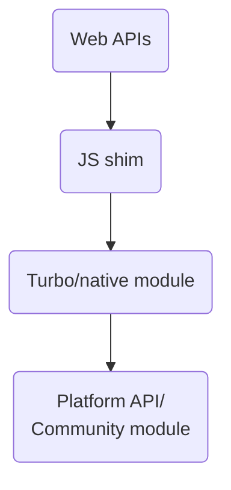

- Title: react-native-standard-api
- Date: 2023-07-04
- RFC PR: (leave this empty)
- rnx-kit Issue: (leave this empty)

## Abstract

React Native currently lacks a well-defined, stable API. Today, we have a "wild
west" of community modules, each with its own set of interfaces and behaviours.
It is the developers' responsibility to find the module that fits their needs
and that is seemingly actively maintained. Additionally, the API are not
compatible with Web APIs, thus closing the door to a wealth of open source
libraries that do not have explicit React Native support. This often means that
developers cannot reuse existing web code, and must search for or even create
one for their needs.

In this RFC, we are proposing to close this gap by providing our own
implementation of the
[Web APIs](https://developer.mozilla.org/en-US/docs/Web/API) for React Native.
The ultimate goal is to open the possibility to run non-UI code directly in a
React Native app; to provide a familiar environment for existing web developers
as well as a well-documented API for developers of any experience level.

## Guide-level explanation

We are aiming to have close to 100% compatibility with Web APIs. This means that
code such as below should just work out of box (or with minimal configuration).

```js
// useBatteryLevel.js
function useBatteryLevel() {
  const [batteryLevel, setBatteryLevel] = useState(-1);
  useEffect(() => {
    navigator.getBattery().then((battery) => setBatteryLevel(battery.level));
  }, [setBatteryLevel]);
  return batteryLevel;
}
```

## Reference-level explanation

Our goal is not to reimplement a browser, e.g.
[Electron](https://www.electronjs.org/). Apps made this way currently ship with
a full browser with everything that entails, including modules that they may
never get used. Native apps, and mobile apps especially, cannot be shipped with
unused bits; nor does it make any sense to include MBs of dependencies that are
never used. Ideally, migrating from community modules to the standard API should
not increase the final app size (at least not significantly).

The API is implemented in layers:



- **Web APIs:** On the surface, there are little to no differences from normal
  web code.

- **JS shim:** This is a thin layer for marshalling web API calls to native
  modules. It needs to be installed before it can be used. The current thinking
  is to install this layer as polyfills. Installing them on-demand is preferred,
  but we need to start somewhere and we should be able to improve this layer
  later without affecting users. In any case, we will need tools to include
  polyfills similarly to [autolinking][].

- **Turbo/native module:** This is the layer that accepts JS calls and forwards
  them platform implementations. A community module can be used here if one
  exists. Modules are installed via the standard autolinking mechanism.

### Modularity

We want to avoid introducing unused modules and adding unnecessary bloat to the
app bundle. The API should therefore be broken down into smaller modules that
can be installed separately. These modules are installed by autolinking, and
must therefore be explicitly added to an app's `package.json`.

Additionally, we want to avoid requiring that users manually add polyfills for
the modules they need. Instead, we propose that modules that implement a part of
the API to declare a polyfill in their `react-native.config.js`:

```js
// react-native.config.js
module.exports = {
  dependency: {
    api: {
      polyfill: "./polyfill.js",
    },
  },
};
```

Polyfills are gathered and passed to Metro via [`serializer.getPolyfills`][].

### Discovery

The number of modules is high. Finding which modules provide which part of Web
APIs can be overwhelming for consumers. We need tools that can tell users which
dependencies they need to add. At minimum we should:

1. Implement a tool for detecting usage of web APIs
   - The tool should be able to list used web APIs and report on uses that have
     not been polyfilled.
   - If possible, the tool should also recommend which dependencies to add
     and/or automatically add it to `package.json`.
   - Note: While we say "tool" here, it doesn't necessarily have to be a
     standalone thing. A Babel plugin or similar would also fit. The less users
     have to worry about it, the better.
2. Add new capabilities to [`@rnx-kit/align-deps`][]
   - `align-deps` ensures that package versions are aligned and can help keeping
     track of transitive dependencies.

## Drawbacks

> TODO: Why should we not do this, and what is the impact of that decision?
> Please consider the cost to educate developers, migrate existing users, and
> maintain the proposed changes.

## Rationale, alternatives, and prior art

- A variation of the current proposal without polyfills was considered, but it
  would require users to change web code to accommodate native. For instance,
  `navigator.getBattery()` would have to be rewritten as
  `require("@react-native-api/battery-manager").getBattery()`.
- There are many polyfills out there, but they are mostly used to provide
  functionalities that are only present in newer ES standards (e.g.
  [`Object.assign`][], [`Object.is`][]). We have not found any that address the
  scope defined here.

## Adoption strategy

> TODO: If we accept this proposal, how will existing developers adopt it? Is
> this a breaking change? Can we write a codemod? Should we coordinate with
> other projects or libraries?

## Unresolved questions

- Which parts of the Web API do we prioritize first?
  - As proof-of-concept, we suggest implementing
    [`BatteryManager`](https://developer.mozilla.org/en-US/docs/Web/API/BatteryManager)
    as it is small and self-contained.
    - Android:
      https://developer.android.com/training/monitoring-device-state/battery-monitoring
    - iOS:
      https://developer.apple.com/documentation/uikit/uidevice/1620051-batterystate

<!-- References -->

[`@rnx-kit/align-deps`]:
  https://github.com/microsoft/rnx-kit/tree/main/packages/align-deps#readme
[`Object.assign`]: https://github.com/ljharb/object.assign/blob/main/polyfill.js
[`Object.is`]: https://github.com/es-shims/object-is/blob/main/polyfill.js
[`serializer.getPolyfills`]:
  https://github.com/facebook/react-native/blob/0.72-stable/packages/metro-config/index.js#L49
[autolinking]:
  https://github.com/react-native-community/cli/blob/main/docs/autolinking.md
