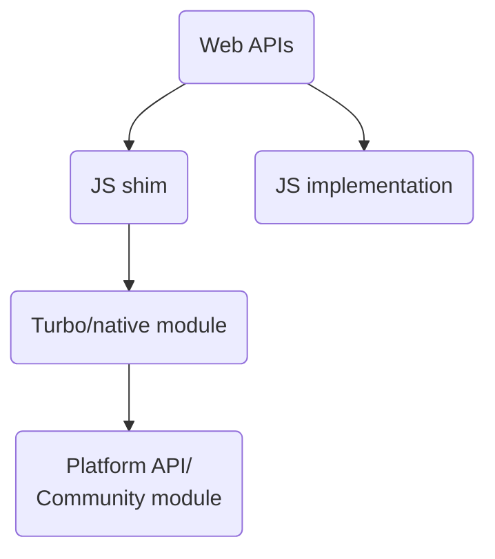

- Title: react-native-webapis
- Date: 2023-07-04
- RFC PR: https://github.com/microsoft/rnx-kit/pull/2504
- rnx-kit Issue: N/A

## Abstract

React Native currently lacks a well-defined, stable and complete API surface.
Compared to what both [Android][] and [iOS][] provide out of the box, React
Native core is missing quite a lot today. To fill that gap, we have a "wild
west" of community modules, each with its own set of interfaces and behaviors.
While this is in line with the broader experience in the web/npm space, at the
end of the day this means that it is the developers' responsibility to find
modules that fit their needs and that are seemingly actively maintained.

Additionally, the APIs are not compatible with Web APIs, thus closing the door
to a wealth of open source libraries that do not have explicit React Native
support. This often means that developers cannot reuse existing web code, and
must search for or even create one for their needs.

In this RFC, we are proposing to close this gap by providing our own
implementation of the [Web APIs][] for React Native. The ultimate goal is to
open the possibility to run non-UI code directly in a React Native app; to
provide a familiar environment for existing web developers as well as a
well-documented API for developers of any experience level.

## Guide-level explanation

We are aiming to have close to 100% compatibility with Web APIs. This means that
code such as below should just work out of box (or with minimal configuration).

```js
// useBatteryLevel.js
function useBatteryLevel() {
  const [batteryLevel, setBatteryLevel] = useState(-1);
  useEffect(() => {
    navigator.getBattery().then((battery) => setBatteryLevel(battery.level));
  }, [setBatteryLevel]);
  return batteryLevel;
}
```

The native platforms we aim to support via react-native are Android, iOS, macOS,
Windows.

## Reference-level explanation

Our goal is not to reimplement a browser, e.g. [Electron][]. Apps made this way
currently ship with a full browser with everything that entails, including
modules that they may never get used. Native apps, and mobile apps especially,
cannot be shipped with unused bits; nor does it make any sense to include MBs of
dependencies that are never used. Ideally, migrating from community modules to
WebAPIs should not increase the final app size (at least not significantly).

We envision the APIs can be implemented in at least two ways:



- **Web APIs:** On the surface, there are little to no differences from typical
  web code.

- The APIs can be implemented as a native module and a shim layer:

  - **JS shim:** This is a thin layer for marshalling web API calls to native
    modules. It needs to be installed before it can be used. The current
    thinking is to install this layer as polyfills. Installing them on-demand is
    preferred, but we need to start somewhere and we should be able to improve
    this layer later without affecting users. In any case, we will need tools to
    include polyfills similarly to [autolinking][].
  - **Turbo/native module:** This is the layer that accepts JS calls and
    forwards them to platform implementations. Modules are installed via the
    standard autolinking mechanism.
    - Note: Some Web APIs may necessitate JSI bindings e.g., to properly manage
      native resources or because the object model in the API lends itself more
      towards live, stateful, graphs of objects which would otherwise require a
      thicker polyfill.
  - **Platform API/Community module:** When available, we want to be able to
    leverage what already exists in the community and avoid creating competing
    solutions. When we need to write from scratch, we want to comply with the
    guidelines for the [new architecture libraries][] provided by Meta.

- Alternatively, native code may not be necessary at all if a complete
  implementation can be done in pure JS.

### Modularity

We want to avoid introducing unused modules and adding unnecessary bloat to the
app bundle. WebAPIs must therefore be broken down into smaller modules that can
be installed separately. These modules are installed by autolinking, and must
therefore be explicitly added to an app's `package.json`.

For example, if you want to use `BatteryStatus` you should not need to import
the whole `react-native-webapis` module, but only the dedicated
`@react-native-webapis/battery-status` submodule.

Additionally, we want to avoid requiring that users manually add polyfills for
the modules they need. Instead, we propose that modules that implement a part of
the API to declare a polyfill in their `react-native.config.js`:

```js
// react-native.config.js
module.exports = {
  dependency: {
    api: {
      polyfill: "./polyfill.js",
    },
  },
};
```

Polyfills are gathered and passed to Metro. Any dependency with a correctly
declared polyfill will be included. They do not need to be under the
`@react-native-webapis` scope or even live in the same repository.

### Infrastructure and repository setup

On top of what has been mentioned above, we are still investigating the right
approach for how the code for this effort should be created and organised. The
most likely approach will involve a monorepo (similar to [`rnx-kit`][]) where
each module will be its own dedicated package.

For starters, we will suggest that implementations for "core" supported
platforms (i.e. Android, iOS, macOS, Windows) be present in the one package — we
won't have `/~/battery-status-android` and `/~/battery-status-ios`, only
`/~/battery-status`. However, it should still be possible to have additional
platform specific implementations, e.g. `/~/battery-status-tvos`. These should
also be treated as first class citizens and be recognized by all tooling.

This should allow for different people to work on different modules at the same
time, while having a coherent infra to rely on for testing, publishing, etc.

During the initial phase of this effort we should keep all the packages marked
as private so that they won't be published to npm. This should allow for more
flexibility in starting to implement code while the details of the final setup
get agreed on.

#### Testing

Ideally we want to rely on the already existing test suites that W3C
[provides for QA](https://www.w3.org/QA/Test/). Here's an example for the
[Geolocation](https://dev.w3.org/geo/api/test-suite/) webapi, and a
[single test](https://dev.w3.org/geo/api/test-suite/t00001.js).

### Prioritization strategy

The number of Web APIs is very high (1000+). Implementing each and every one of
them for all the platforms will take a massive amount of time and funding —
realistically, we need a strategy to decide how to select and prioritize which
APIs to work on.

As part of our investigation, we have created
[a script](https://github.com/microsoft/rnx-kit/tree/main/incubator/%40react-native-webapis/types)
that extracts the interfaces from the TS typings for webapis (from
`https://unpkg.com/@mdn/browser-compat-data/data.json`) and allows us to filter
them, removing the ones we know for sure we don't want to implement
([ex. DOM, HTML, etc](https://github.com/microsoft/rnx-kit/blob/main/incubator/%40react-native-webapis/types/generate.mjs#L10)).
That still leaves us with around 200 APIs, still way too many.

To pair with the script we have been working on a
[tool to scan](https://github.com/microsoft/rnx-kit/pull/2621) the usage of
webapis across a codebase. This allows us to verify which APIs are relevant and
can get higher priority.

This is where the need for a monorepo with a quick devloop comes in handy: so
that partners/interested companies can volunteer to take ownership of some
specific webapis and work on them in parallel, in a coordinate manner.

### Discovery

The number of modules is high. Finding which modules provide which part of Web
APIs can be overwhelming for consumers. We need tools that can tell users which
dependencies they need to add. At minimum we should:

1. Implement a tool for detecting usage of web APIs
   - The tool should be able to list used web APIs and flag uses that have not
     been polyfilled.
   - If possible, the tool should also recommend which dependencies to add
     and/or automatically add it to `package.json`.
   - **Note:** While we say "tool" here, it doesn't necessarily have to be a
     standalone thing. A Babel plugin or similar would also fit. The less users
     have to worry about it, the better.
2. Add new capabilities to [`@rnx-kit/align-deps`][]
   - `align-deps` ensures that package versions are aligned and can help keeping
     track of transitive dependencies.

## An example implementation

As proof-of-concept, we've implemented the [Battery Status API][] as it is small
and self-contained. The code can be
[found here](https://github.com/microsoft/rnx-kit/pull/2590).

To get it to work, we had to use a custom plugin
([`@rnx-kit/polyfills`](https://github.com/microsoft/rnx-kit/tree/main/incubator/polyfills))
and rely on a "magic comment" in the bundle to generate import statements. An
alternative implementation would be to use something akin to Webpack's [entry
points][]. More details here: https://github.com/facebook/metro/issues/850.

This implementation allowed us to establish some common pattern to be reused in
future web APIs implementations such as the subfolders division and the
convention native-side of using `RNW<webapi name>` as module name. On top of
this we will be preparing a shallow template to allow a quicker generation of
new web APIs that will follow the existing DX in rnx-kit of using
`yarn new-package <package-name>` as
[detailed here](https://github.com/microsoft/rnx-kit/blob/main/CONTRIBUTING.md#adding-a-new-package).

## Drawbacks

- Existing React Native apps might need to be adapted this new paradigm.
- A lot of the tooling needed for this effort to succeed as detailed above needs
  to be created.
- The number of Web APIs is very high (1000+). See the section above about
  prioritization strategy for more details on how we are planning to tackle
  this.
- It looks like it's very hard to properly detected how ownership about an API
  endpoint works, tracking usage and if it's viable or not. For example, it's
  kind of surprising to find that the only clear reference about the Battery
  Status API being deprecated is
  [in a comment in a PR in a TS repo](https://github.com/microsoft/TypeScript-DOM-lib-generator/pull/236).
  The official documentation doesn't seem to reflect actual status that well
  https://w3c.github.io/battery/#the-batterymanager-interface
  - Our current idea would be to leverage the existence or not of said API in
    the TS interface (which is also what we use for our script for generating
    the "valid interfaces" mentioned above), using it as "realistic source of
    truth"

## Rationale, alternatives, and prior art

- A variation of the current proposal without polyfills was considered, but it
  would require users to change web code to accommodate native. For instance,
  `navigator.getBattery()` would have to be rewritten as
  `require("@react-native-webapis/battery-status").getBattery()`.
  - On the other hand, this approach has the advantage of not polluting the
    global space with typings for APIs that may not be available in your
    project.
- There are many polyfills out there, but they are mostly used to provide
  functionalities that are only present in newer ES standards (e.g.
  [`Object.assign`][], [`Object.is`][]). We have not found any that address the
  scope defined here.
- [React Native Test App][] will be used as the sandbox tool to build the
  modules against to reduce friction and have "out of the box" the ability to
  test across all the target platforms.
- This goal of web-like code working via React Native on multiple platforms is
  shared with Meta's [RFC: React DOM for Native][], which should be considered
  complementary to the proposal presented here.

## Adoption strategy

We will be following the crawl-walk-run methodology:

- **Crawl stage:** Only one module will be implemented so that the tooling and
  infrastructure can be built and flows can be set up. The infrastructure should
  allow for multiple teams and developers to work discretely on the specific
  modules that they are interested in, removing most of the friction to enable
  contributors to just focus on producing code. We want to evaluate whether
  things up to this point still make sense and adapt if otherwise.

- **Walk stage:** One or more modules will be adopted as experimental within a
  few selected production apps to validate the concept and implementation. This
  implies that we have worked out what modules to prioritize by this stage.

- **Run stage:** By this stage, we aim to have a good level of confidence on the
  viability of this proposal. Documentation on how to use this new set of
  modules will be prepared to help developers leverage them to bring their web
  code to native platforms.

## Unresolved questions

- How do we keep track of which WebAPIs are at which stage of their
  support/implementation on the web side, so that we don't want on
  unused/deprecated APIs?
- How do we want to track and coordinate work on each web API? An idea could be
  to have an umbrella issue in the `rnx-kit` repository that serves as an
  overall tracker, indicating (only) which web APIs are being worked on, who is
  working on them, and status of the implementation (statuses to be defined).
- If the overall idea is to get web and native code to be used the same way,
  what bundler should then be used in the web app and which in the native app?
  Should it be the same? Further investigations ongoing.

<!-- References -->

[`@rnx-kit/align-deps`]:
  https://github.com/microsoft/rnx-kit/tree/main/packages/align-deps#readme
[`Object.assign`]: https://github.com/ljharb/object.assign/blob/main/polyfill.js
[`Object.is`]: https://github.com/es-shims/object-is/blob/main/polyfill.js
[`rnx-kit`]: https://github.com/microsoft/rnx-kit
[`serializer.getModulesRunBeforeMainModule`]:
  https://github.com/facebook/react-native/blob/0.72-stable/packages/metro-config/index.js#L49
[Android]: https://developer.android.com/reference
[Battery Status API]:
  https://developer.mozilla.org/en-US/docs/Web/API/Battery_Status_API
[Electron]: https://www.electronjs.org/
[RFC: React DOM for Native]:
  https://github.com/react-native-community/discussions-and-proposals/pull/496
[React Native Test App]: https://github.com/microsoft/react-native-test-app
[Web APIs]: https://developer.mozilla.org/en-US/docs/Web/API
[autolinking]:
  https://github.com/react-native-community/cli/blob/main/docs/autolinking.md
[entry points]: https://webpack.js.org/concepts/entry-points/
[iOS]: https://developer.apple.com/documentation/technologies
[new architecture libraries]:
  https://github.com/reactwg/react-native-new-architecture/discussions/categories/libraries
