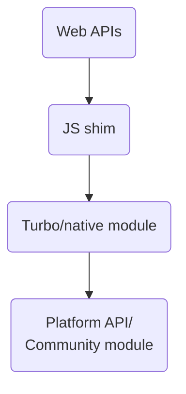

- Title: react-native-webapis
- Date: 2023-07-04
- RFC PR: https://github.com/microsoft/rnx-kit/pull/2504
- rnx-kit Issue: N/A

## Abstract

React Native currently lacks a well-defined, stable and complete API surface.
Compared to what both [Android](https://developer.android.com/reference) and
[iOS](https://developer.apple.com/documentation/technologies) provide out of the
box, React Native core is missing quite a lot today. To fill that gap, we have a
"wild west" of community modules, each with its own set of interfaces and
behaviors. While this is in line with the broader experience in the web/npm
space, at the end of the day this means that it is the developers'
responsibility to find modules that fit their needs and that are seemingly
actively maintained.

Additionally, the APIs are not compatible with Web APIs, thus closing the door
to a wealth of open source libraries that do not have explicit React Native
support. This often means that developers cannot reuse existing web code, and
must search for or even create one for their needs.

In this RFC, we are proposing to close this gap by providing our own
implementation of the
[Web APIs](https://developer.mozilla.org/en-US/docs/Web/API) for React Native.
The ultimate goal is to open the possibility to run non-UI code directly in a
React Native app; to provide a familiar environment for existing web developers
as well as a well-documented API for developers of any experience level.

## Guide-level explanation

We are aiming to have close to 100% compatibility with Web APIs. This means that
code such as below should just work out of box (or with minimal configuration).

```js
// useBatteryLevel.js
function useBatteryLevel() {
  const [batteryLevel, setBatteryLevel] = useState(-1);
  useEffect(() => {
    navigator.getBattery().then((battery) => setBatteryLevel(battery.level));
  }, [setBatteryLevel]);
  return batteryLevel;
}
```

The native platforms we aim to support via react-native are Android, iOS, macOS,
Windows.

## Reference-level explanation

Our goal is not to reimplement a browser, e.g.
[Electron](https://www.electronjs.org/). Apps made this way currently ship with
a full browser with everything that entails, including modules that they may
never get used. Native apps, and mobile apps especially, cannot be shipped with
unused bits; nor does it make any sense to include MBs of dependencies that are
never used. Ideally, migrating from community modules to WebAPIs should not
increase the final app size (at least not significantly).

The API we envision are implemented in the following layers:



- **Web APIs:** On the surface, there are little to no differences from typical
  web code.

- **JS shim:** This is a thin layer for marshalling web API calls to native
  modules. It needs to be installed before it can be used. The current thinking
  is to install this layer as polyfills. Installing them on-demand is preferred,
  but we need to start somewhere and we should be able to improve this layer
  later without affecting users. In any case, we will need tools to include
  polyfills similarly to [autolinking][].

- **Turbo/native module:** This is the layer that accepts JS calls and forwards
  them platform implementations. Modules are installed via the standard
  autolinking mechanism.

- **Platform API/Community module:** When available, we want to be able to
  leverage what already exists in the community and avoid creating competing
  solutions. When we need to write from scratch, we want to comply with the
  guidelines for the
  [new architecture libraries](https://github.com/reactwg/react-native-new-architecture/discussions/categories/libraries)
  provided by Meta.

### Modularity

We want to avoid introducing unused modules and adding unnecessary bloat to the
app bundle. WebAPIs must therefore be broken down into smaller modules that can
be installed separately. These modules are installed by autolinking, and must
therefore be explicitly added to an app's `package.json`.

For example, if you want to use `BatteryStatus` you should not need to import
the whole `react-native-webapis` module, but only the dedicated
`@react-native-webapis/battery-status` submodule.

Additionally, we want to avoid requiring that users manually add polyfills for
the modules they need. Instead, we propose that modules that implement a part of
the API to declare a polyfill in their `react-native.config.js`:

```js
// react-native.config.js
module.exports = {
  dependency: {
    api: {
      polyfill: "./polyfill.js",
    },
  },
};
```

Polyfills are gathered and passed to Metro. Any dependency with a correctly
declared polyfill will be included. They do not need to be under the
`@react-native-webapis` scope or even live in the same repository.

### Infrastructure and repository setup

On top of what has been mentioned above, we are still investigating the right
approach for how the code for this effort should be created and organised. The
most likely approach will involve a monorepo (similar to
[`rnx-kit`](https://github.com/microsoft/rnx-kit)) where each module will be its
own dedicated package. For starters, we will suggest that implementations for
"core" supported platforms (i.e. Android, iOS, macOS, Windows) be present in the
one package — we won't have `/~/battery-status-android` and
`/~/battery-status-ios`, only `/~/battery-status`. However, it should still be
possible to have additional platform specific implementations, e.g.
`/~/battery-status-tvos`. These should also be treated as first class citizens
and be recognized by all tooling.

This should allow for different people to work on different modules at the same
time, while having a coherent infra to rely on for testing, publishing, etc.

### Discovery

The number of modules is high. Finding which modules provide which part of Web
APIs can be overwhelming for consumers. We need tools that can tell users which
dependencies they need to add. At minimum we should:

1. Implement a tool for detecting usage of web APIs
   - The tool should be able to list used web APIs and flag uses that have not
     been polyfilled.
   - If possible, the tool should also recommend which dependencies to add
     and/or automatically add it to `package.json`.
   - **Note:** While we say "tool" here, it doesn't necessarily have to be a
     standalone thing. A Babel plugin or similar would also fit. The less users
     have to worry about it, the better.
2. Add new capabilities to [`@rnx-kit/align-deps`][]
   - `align-deps` ensures that package versions are aligned and can help keeping
     track of transitive dependencies.

## Drawbacks

- Existing React Native apps might need to be adapted this new paradigm.
- A lot of the tooling needed for this effort to succeed as detailed above needs
  to be created.
- The number of Web APIs is very high. Implementing each and every one of them
  for all the platforms will take a massive amount of time and funding —
  realistically, we will select a subset of APIs to focus on, based on needs and
  real usage data.

## Rationale, alternatives, and prior art

- A variation of the current proposal without polyfills was considered, but it
  would require users to change web code to accommodate native. For instance,
  `navigator.getBattery()` would have to be rewritten as
  `require("@react-native-webapis/battery-status").getBattery()`.
- There are many polyfills out there, but they are mostly used to provide
  functionalities that are only present in newer ES standards (e.g.
  [`Object.assign`][], [`Object.is`][]). We have not found any that address the
  scope defined here.
- [React Native Test App](https://github.com/microsoft/react-native-test-app)
  will be used as the sandbox tool to build the modules against to reduce
  friction and have "out of the box" the ability to test across all the target
  platforms.
- This goal of web-like code working via React Native on multiple platforms is
  shared with Meta's
  [RFC: React DOM for Native](https://github.com/react-native-community/discussions-and-proposals/pull/496),
  which should be considered complementary to the proposal presented here.

## Adoption strategy

We will be following the crawl-walk-run methodology:

- **Crawl stage:** Only one module will be implemented so that the tooling and
  infrastructure can be built and flows can be set up. The infrastructure should
  allow for multiple teams and developers to work discretely on the specific
  modules that they are interested in, removing most of the friction to enable
  contributors to just focus on producing code. We want to evaluate whether
  things up to this point still make sense and adapt if otherwise.

- **Walk stage:** One or more modules will be adopted as experimental within a
  few selected production apps to validate the concept and implementation. This
  implies that we have worked out what modules to prioritize by this stage.

- **Run stage:** By this stage, we aim to have a good level of confidence on the
  viability of this proposal. Documentation on how to use this new set of
  modules will be prepared to help developers leverage them to bring their web
  code to native platforms.

## Unresolved questions

- Which parts of the Web API do we prioritize first?
  - As proof-of-concept, we've implemented the
    [`Battery Status API`](https://developer.mozilla.org/en-US/docs/Web/API/Battery_Status_API)
    as it is small and self-contained.
    - https://github.com/microsoft/rnx-kit/pull/2590
    - We're currently using a Babel plugin and rely on a magic comment in the
      bundle to generate import statements. To further automate this, we would
      need something akin to Webpack's
      [entry points](https://webpack.js.org/concepts/entry-points/). More
      details here: https://github.com/facebook/metro/issues/850.

<!-- References -->

[`@rnx-kit/align-deps`]:
  https://github.com/microsoft/rnx-kit/tree/main/packages/align-deps#readme
[`Object.assign`]: https://github.com/ljharb/object.assign/blob/main/polyfill.js
[`Object.is`]: https://github.com/es-shims/object-is/blob/main/polyfill.js
[`serializer.getModulesRunBeforeMainModule`]:
  https://github.com/facebook/react-native/blob/0.72-stable/packages/metro-config/index.js#L49
[autolinking]:
  https://github.com/react-native-community/cli/blob/main/docs/autolinking.md
